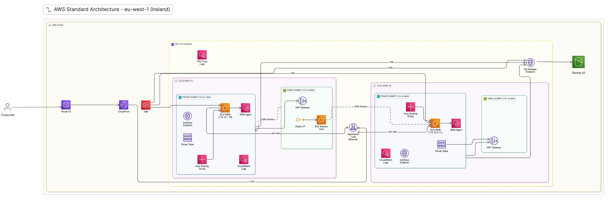

Infrastructure as Code project for AWS using Terraform, focused on best practices and scalability.

This repository demonstrates:
- Modular and reusable Terraform configurations
- Scalable infrastructure design patterns
- Continuous refactoring and optimization
- Production-ready deployment practices
- Clean code principles for IaC

## AWS Architecture

---

## Technology Stack

  
  
  

